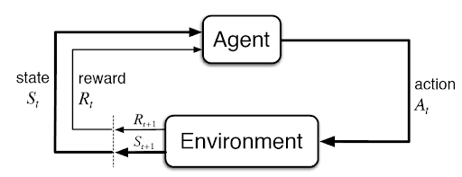

# Reinforcment Learning - RL 

Overview of reinforcment methods.

## Table of Conent 
- [What is RL?](#what-is-rl)
- [Value and Policy methods](#value-and-policy-methods)
- [Q-learning and Deep Q Network](#generative-models)
- [Policy Gradient Methods](#policy-gradient-methods)
- [Reinforce Algorithm](#reinforce-algorithm)
- [Proximal Policy Optimization](#proximal-policy-optimization)
- [Project Implementation](#project-implementation)
- [Code](#code)
- [Results](#results)

# What is RL? 

Reinforcment learning formulated as a markov decision process (MDP): An agent interactes in the environment. Takes an action and performs it, then enviornment gives a reward and new state. The goal of the agent is to learn the **optimal** policy, maximixing the expected cumulative reward. 

> "A policy is the brain of the agent. What action to take given the sate we're in."

Markov Decision Process - MDP

# Two main types of RL 

### Value based methods

By training a value function that outputs the value of a state or a state-action pair. Given this value function, our policy will take an action. Policy is a function defined by hand 

Estimate either state or the state action value. 

- State-value (fig 2) or state-action-value function (fig 3)

- State -> Q(State) -> Values of state Action pair -> policy(State) -> Action

With the value functions we're indirectly learning a policy. Example policy, greedy: $\pi^* (s) = argmax_a Q^*(s,a)$. Takes the action in the state which gives the highes quality. 

### Policy based methods

Directly train the policy to select what action to take given a state (or a probability distribution over actions at that state)

- State -> policy(state) -> Action
- Determnistic policy: one action
- Stochastic polic: probability distribution

# Q-learning and DQN 

Q-Learning is the algorithm we use to train our Q-function, an action-value function that determines the value of being at a particular state and taking a specific action at that state

Recap the difference between value and reward:

- The *value of a state*, or a *state-action pair* is the expected cumulative reward our agent gets if it starts at this state (or state-action pair) and then acts accordingly to its policy.

- The *reward* is the **feedback I get from the environment** after performing an action at a state.

## Q-learning 
- The Bellman Equation: used to update state, given the neighbouring states.
- Q-table (contains action value pairs)
- Given state-action pair, search Q-table
- Problem with large state space

Bellman Equation

$$
Q^* (s,a) = E_{s',r} [r + \gamma max_{a'} Q^* (s',a') | s,a]
$$

- For the current state-action pair (s,a), we observe the reward $r$ and the next state $s'$. 
- Estimate value of next state $s'$ by finding the maximum  Q-value for all possible actions in $s': max_{a'} Q(s', a') $
- Gives an estimate of all future rewards starting from $s'$

More about the bellman equation [here]()

## Deep Q-learning

Deep Q-Learning uses a neural network to approximate, given a state, the different Q-values for each possible action at that state

Different methods of implmenetation:

- Q-target (for example computed with bellman equation)
- Q-value prediction 
- Gradient decent on loss (Q-target - Q-prediction)
- Problem; not very stable.

Function approximation is iteratively improved based on the Bellman equation. By estimating the value of the next state and adjusting the current Q-value prediction accordingly, we are effectively propagating information about future rewards back to the current state.

# Policy Gradient Methods

Policy methods: parameterize the policy and optimize it directly. 

Training loop: 
1. Collect an episode with the policy: $(S, A, r_{t+1}, S_{t+1}, A_{t+1}, r_{t+2} ... )$
2. Calculate the return (sum of rewards). Discounted as rewards in the future worth less $R(\tau) =r_{t+1} + \gamma r_{t+2} + \gamma^2 r_{t+3} $ 
3. Update the weights of the policy:
- a) if positive return -> increase the probability of state action pairs taken in the episode
- b) if negative return -> decrease the probability of state-action pairs taken in the episode

Stochastic Policy
$$
\pi_\theta (s) = P[A|s;\theta]
$$

We have our stocastic policy, and need to evaulate the trajectories we sample from our policy. Done by introducing the objective function which is the expected return of the cumulative return. 

Objective Fucntion

$$
J(\theta) = E_{\tau ~\pi [R(\tau)]}
$$

## Policy Gradient Theorem 

$$
J(\theta) = \sum_t P(\tau | \pi_\theta ) R(\tau) = E[R(\tau)]
$$

The expected return is the average, or weighted return of our trajectories. When we want to maximize the return, we need the gradient, points us in the steepest acend. The policy gradient theorem tells us this can by done like this: 

$$
\nabla J(\theta) = E [\sum_{t=0}^T \nabla_{\theta} log \pi_{\theta} (a_t | s_t) R(t)]
$$

Can be done by taking the gradient of the log probabilities multiplied with expected return. 
